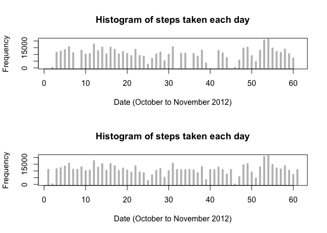

# Reproducible Research: Peer Assessment 1


First, remove everything in environment and add neccessary libraries

```r
rm(list=ls(all=TRUE)) 
library(dplyr)
```

```
## Warning: package 'dplyr' was built under R version 3.1.2
```

```
## 
## Attaching package: 'dplyr'
## 
## The following object is masked from 'package:stats':
## 
##     filter
## 
## The following objects are masked from 'package:base':
## 
##     intersect, setdiff, setequal, union
```

```r
library(lubridate)
```

```
## Warning: package 'lubridate' was built under R version 3.1.2
```

```r
library(data.table)
```

```
## Warning: package 'data.table' was built under R version 3.1.2
```

```
## 
## Attaching package: 'data.table'
## 
## The following objects are masked from 'package:lubridate':
## 
##     hour, mday, month, quarter, wday, week, yday, year
## 
## The following objects are masked from 'package:dplyr':
## 
##     between, last
```

```r
library(lattice)
```


##Loading and preprocessing the data
Unzip and read activity.csv to activities variable

```r
unzip("activity.zip")
activities <- read.csv('activity.csv', header = T)
names(activities)
```

```
## [1] "steps"    "date"     "interval"
```

```r
str(activities)
```

```
## 'data.frame':	17568 obs. of  3 variables:
##  $ steps   : int  NA NA NA NA NA NA NA NA NA NA ...
##  $ date    : Factor w/ 61 levels "2012-10-01","2012-10-02",..: 1 1 1 1 1 1 1 1 1 1 ...
##  $ interval: int  0 5 10 15 20 25 30 35 40 45 ...
```

```r
head(activities)
```

```
##   steps       date interval
## 1    NA 2012-10-01        0
## 2    NA 2012-10-01        5
## 3    NA 2012-10-01       10
## 4    NA 2012-10-01       15
## 5    NA 2012-10-01       20
## 6    NA 2012-10-01       25
```

## What is mean total number of steps taken per day?
Group and summarise activities_per_day to get table that has total steps for each day

```r
activities_per_day <- group_by(activities, date)
activities_per_day <- summarise(activities_per_day, total_steps = sum(steps))
```

Mean and Median value for total steps each day

```r
mean_value <- mean(activities_per_day$total_steps, na.rm = T)
median_value <- median(activities_per_day$total_steps, na.rm = T)
```

Plot the graph

```r
plot(activities_per_day$total_steps, main="Histogram of steps taken each day", 
     xlab="Date (October to November 2012)", ylab="Frequency", type="h", lwd=4, col="grey")

abline(h=mean_value, lwd =4, col = 'blue')
abline(h=median_value, lwd = 3, col = 'red')

legend('topright', lty = 1, lwd = 3, col = c("blue", "red"),bty="n",
       cex = .8, 
       legend = c(paste('Mean: ', mean_value),
                  paste('Median: ', median_value)))
```

 


## What is the average daily activity pattern?
Group and summarise activities_per_day to get table that has average steps for each interval

```r
activities_per_interval <- group_by(activities, interval)
activities_per_interval <- summarise(activities_per_interval[!is.na(activities_per_interval$steps),], mean_steps = mean(steps))
```

Find out Max step and add the line in graph

```r
maxStepsByInterval <- max(activities_per_interval$mean_steps)
activities_per_interval_table <- data.table(activities_per_interval)
maxInterval <- activities_per_interval_table[mean_steps == maxStepsByInterval]$interval
```

Plot the graph

```r
plot(activities_per_interval, type="l",
     main="Average number of steps per interval across all days", 
     xlab="Interval", ylab="Average # of steps across all days", 
     lwd=2, col="grey")

abline(v=maxInterval, col="red", lwd=3)
```

 

## Imputing missing values
Print out value of total activities that do not have steps value

```r
sum(is.na(activities$steps))
```

```
## [1] 2304
```

Function to return steps. If steps is NA, return average steps of the interval instead

```r
getSteps = function(steps,averageSteps){
  if(is.na(steps)){
    return(averageSteps)
  }
  return(steps)
}
```

Plot 2 graphs to compare before and after filling up NA with average steps

```r
activities_table <- data.table(activities)
activities_per_interval_table <- data.table(activities_per_interval)
activities_table$newSteps <- mapply(getSteps,activities_table$steps, activities_per_interval_table$mean_steps)

par(mfrow=c(2,1))
plot(activities_per_day$total_steps, main="Histogram of steps taken each day", 
     xlab="Date (October to November 2012)", ylab="Frequency", type="h", lwd=4, col="grey")


activities_filled_per_day <- group_by(activities_table, date)
activities_filled_per_day <- summarise(activities_filled_per_day, total_steps = sum(newSteps))
mean_value_filled <- mean(activities_filled_per_day$total_steps, na.rm = T)
median_value_filled <- median(activities_filled_per_day$total_steps, na.rm = T)

plot(activities_filled_per_day$total_steps, main="Histogram of steps taken each day", 
     xlab="Date (October to November 2012)", ylab="Frequency", type="h", lwd=4, col="grey")
```

 

## Are there differences in activity patterns between weekdays and weekends?
Function to return "weekend" or "weekday" by day of the week

```r
getDayOfTheWeekType = function(x){
  if(x %in% c('1', '7')){
    return('weekend')
  }
  
  return('weekday')
}
```

Create activities table that group by weekend/weekday and interval

```r
activities_table <- mutate(activities_table, day_of_the_week = wday(ymd(date)))
activities_table$day_of_the_week_type <- mapply(getDayOfTheWeekType, activities_table$day_of_the_week)
activities_table_processed = activities_table[, list(avg_steps = mean(newSteps, na.rm = T)), 
                                    by = list(interval, day_of_the_week_type)]
```

Plot the graph

```r
xyplot(avg_steps~interval | day_of_the_week_type, data = activities_table_processed,
       type = 'l',
       xlab = 'Interval',
       ylab = 'Number of Steps',
       layout = c(1,2))
```

 

